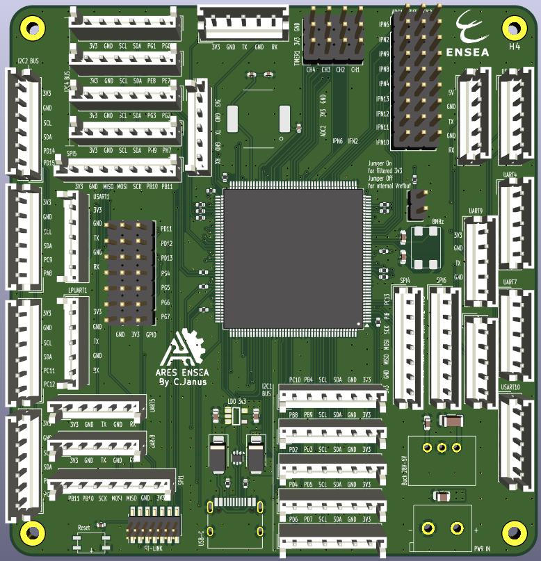
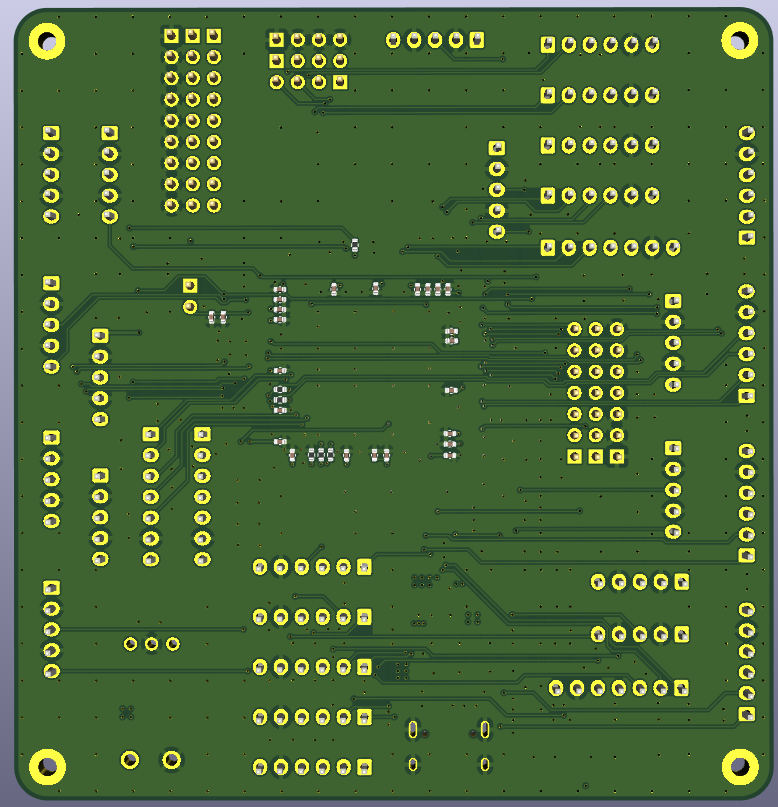

# Carte mère – Coupe de France de Robotique

> Carte mère basée sur un **STM32H5** en boîtier **LQFP177**.  
> Conçue pour centraliser la communication et le pilotage des modules du robot, avec une connectique optimisée pour la robustesse et la modularité.

---

## Caractéristiques principales

- **Microcontrôleur** : STM32H5, LQFP177  
- **Interfaces série** : 12 UARTs, chacun exposé sur connecteurs **VCC – GND – TX – GND – RX** afin de permettre le torsadage avec un retour GND pour une meilleure intégrité du signal  
- **Bus I²C** : 3 bus indépendants, jusqu’à **13 connexions** possibles (chaque connecteur fournit 2 GPIOs, GND et 3V3)  
- **Convertisseurs analogiques (ADC)** : 12 entrées, rangées avec alimentation 3V3 et GND pour faciliter le câblage  
- **USB-C** : un connecteur intégré pour programmation et alimentation  
- **Timers** : 12 broches disponibles pour PWM et capture/compare  
- **GPIO** : 10 broches générales, chacune associée à GND et 3V3 pour plus de flexibilité  
- **SPI** : 4 full duplex master, avec chacun des broches power et deux gpios 

---

## Vues du PCB

### Face composants

### Face cuivre arrière

